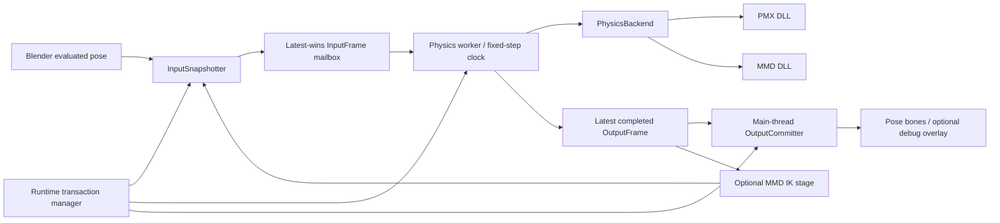

# Physics Runtime V2 性能架构

状态：PHASE 1 BASELINE + PHASE 3 LIFECYCLE SLICE BASELINE
日期：2026-08-24

## 1. 结论

本轮重构应先重写 Blender host runtime，而不是先重写三个 native solver。

- Phase 1 保持三个 DLL 的 solver core 不变，用统一 backend 接口隔离当前实现。
- Phase 2 只让两个 physics DLL 同步升级批处理 ABI；它们继续保持独立二进制、独立构建工具链和独立物理语义。
- `mmd_bone_solver.dll` 不进入首轮性能重构；等无 IK 的 physics path 达标后，再接入统一调度器并按需要升级批处理 ABI。
- “清空用户变换”、Undo/Redo 和模式切换不再用更多局部 handler 修补，而是由 runtime transaction + epoch 统一处理。

## 2. 当前证据

测试对象：原始 `04.blend`，`CURRENT_PROXY`，60 Hz，10 substeps，显示刚体，MMD IK 兼容关闭，持续移动左足 IK。

| 路径 | 编辑/视图操作 | prepare | native step | outputs | apply | 单轮总计 |
|---|---:|---:|---:|---:|---:|---:|
| PMX | 11.19 ms | 13.75 ms | 0.97 ms | 0.04 ms | 17.25 ms | 43.20 ms |
| MMD | 11.28 ms | 3.35 ms | 0.96 ms | 0.04 ms | 16.87 ms | 32.50 ms |

已经确认：

1. native solver step 约 1 ms，输出读取约 0.04 ms，并不是当前低帧的主因。
2. PMX path 从不进入现有 optimized input path；MMD path 也只有在非常狭窄的条件下才能进入。
3. 当前 optimized interactive path 会按 `preview_frequency / 30` 降低 presentation 频率；60 Hz simulation 实际只按约 30 Hz 展示。
4. 当前主线程仍承担 pose 扫描、强制 view-layer 更新、逐刚体 target 提交、逐骨/刚体/Joint 回写和再次更新。
5. MMD IK 关闭时 `physics_bridge` 会委托给原 physics runtime，因此“不开 IK 也低帧”不是 IK bridge 单独造成的。
6. `292dcb3` 引入的 `PreviewDeadlineScheduler` 会在单轮工作超过 16.7 ms 时把下一次 Blender main-thread timer 压到最小 1 ms。以当前 PMX 单轮约 43 ms 计算，runtime 会近似连续执行 `43 ms work + 1 ms yield`；旧 runtime 则在一轮结束后仍返回完整 interval。它是“开启 PMX 后整个 Blender 不再流畅”的首要回归嫌疑，但仍需在同一 `04.blend` 上做旧/新 commit A/B profiler 才能定案。

推断：即使立即重写 solver 数学，最多只能回收约 1 ms，无法解决 32–43 ms 的 host frame。

## 3. V2 目标与非目标

### 目标

- simulation 固定步进与 viewport presentation 解耦。
- 无固定 30 FPS 展示上限。
- 解除展示上限不得改变 simulation tick：物理始终按完整 fixed-step 序列推进，只允许丢弃过期的 presentation frame，不允许跳过中间 physics step。
- 稳定 tick 不强制 `depsgraph` / view-layer 更新。
- 每个可见输出帧最多一次必要的 Blender evaluation。
- 不扫描与当前 physics/IK dependency closure 无关的骨骼。
- debug 显示不再决定物理解算帧率。
- Reset、清空用户变换、Undo/Redo、启停和 solver 切换使用同一套显式生命周期。
- 保持 PMX/MMD solver 的现有数学语义和构建工具链边界。

### 非目标

- 首阶段不合并两个 physics DLL。
- 首阶段不改 physics 算法、碰撞算法或约束求解数学。
- 首阶段不扩大 MMD IK 覆盖范围。
- 不用异步线程直接读写 `bpy` 数据。

## 4. 总体结构



### 4.1 `RuntimeOrchestrator`

单一所有者，负责：

- session 生命周期和 state transition；
- simulation epoch、pose generation、reset generation；
- physics/IK 执行顺序；
- 丢弃 Reset、Undo/Redo 或模型重绑之前产生的 stale output；
- 保证同一 tick 不出现多套 handler 重复捕获/回写。

建议状态：

`STOPPED -> STARTING -> RUNNING -> USER_EDIT_DIRTY / RESET_PENDING / UNDO_REBIND -> RUNNING -> STOPPING`

### 4.2 `InputSnapshotter`

- 只在 Blender 主线程运行。
- 从已经完成 evaluation 的 pose 读取输入，不主动为了采集输入再调用 `_update_view_layer()`。
- 预先构建 rigid type 0 target、physics driver、IK target/chain 及其必要祖先的 dependency closure。
- depsgraph handler 只记录 dirty generation；每个 UI event/frame 最多生成一个 `InputFrame`。
- 使用 dirty bitset/index list，而不是每 tick 扫描全部 pose bones。

### 4.3 `PhysicsWorker`

- 只处理纯数值 frame，不接触任何 `bpy` 对象。
- 固定 timestep；simulation 与 viewport refresh 解耦。
- latest-wins：主线程来不及展示时丢弃旧 presentation frame，不积压展示队列，也不产生 catch-up spiral；simulation tick 本身不可丢弃。
- worker 输出携带 `session_epoch`、`pose_generation` 和 `simulation_tick`。

时间映射固定为：

```text
timeline_seconds = scene_frame / scene_fps
target_simulation_tick = floor(timeline_seconds * fixed_hz)
physics_dt = 1 / fixed_hz
```

viewport 低于 `fixed_hz` 时只是不展示部分中间结果。若 solver 无法实时完成完整 tick，runtime 必须选择降低播放速度或执行有上限的 catch-up，禁止用可变 `dt` 或跳 tick 伪装同步。

### 4.4 `OutputCommitter`

- 只在 Blender 主线程运行。
- 一次 guarded batch 写入所有必要 `PoseBone.matrix_basis`。
- 只在确有可见结果变化时触发一次 Blender evaluation。
- 不再默认逐帧写每个 rigid/Joint Object。
- 当前 Object 型 debug presentation 在启用时必须随每个 solver tick 提交，不能以限频制造可见刚体延迟；后续可改为 batched GPU overlay，关闭 debug 时完全不付出对象回写成本。

### 4.5 `PoseTransactionManager`

把清空用户变换等操作视为显式 transaction，而不是从若干帧的矩阵差异猜测：

1. `begin_user_operation(operation_id, selection_snapshot)`；
2. 暂停旧 frame commit，并提升 epoch；
3. 记录操作前 authored pose 与 physics-owned output；
4. Blender 完成 operator 后，在新的 evaluated pose 上重建输入基线；
5. 清除旧 worker output、IK feedback 和 driver cache；
6. 从确定的新基线恢复 simulation；
7. Undo/Redo 使用同一条 rebind 路径。

这样 `仅选中` 的开关只决定 transaction 的 authored-pose 修改范围，不再改变 runtime 对骨链基线的解释。

## 5. ABI 策略

### 5.1 Phase 1：不改 DLL

先在 Python 侧引入窄接口：

```text
PhysicsBackend.create_world(...)
PhysicsBackend.submit_frame(InputFrame)
PhysicsBackend.step(dt, substeps)
PhysicsBackend.read_frame(OutputFrame)
PhysicsBackend.reset(epoch)
```

现有 ctypes 逐项调用先封装在 backend 内，借此验证新 host loop 能回收多少时间。

### 5.2 Phase 2：两个 physics DLL 同步升级 ABI

新增批处理 frame ABI，而不是改 solver core：

```text
step_frame(world, input_ptr, input_count, dirty_ptr, dirty_count,
           dt, substeps, output_ptr, output_capacity, flags)
```

目标：

- 一次跨 FFI 提交全部 target；
- 一次 step；
- 一次读取当前需要的 bone/body output；
- 支持 dirty indices/bitset；
- 保留 ABI version/capability 查询，旧 DLL fail closed。

两个 physics DLL 必须同步实现同一 ABI contract，但不得因此合并源树、二进制或构建工具链。

### 5.3 Phase 3：`mmd_bone_solver.dll`

IK DLL 继续独立、可选。只有在无 IK 的 physics V2 已达标后，才评估：

- 批量提交 live pose；
- 只返回被接管 IK chain 的输出；
- 用同一 `session_epoch` / `pose_generation`；
- 取消 IK bridge 自己的额外 depsgraph 更新和独立恢复逻辑。

执行顺序固定为：

```text
authored pose snapshot
-> optional native IK pre-physics
-> physics frame
-> optional IK post-physics feedback
-> one Blender output commit
```

## 6. 实施阶段

### Phase 0：隔离基线

- 当前工作树包含多组未提交改动；实现 V2 前先建立可回退的独立 checkpoint/branch 或 worktree。
- 保存当前高跟鞋无漂移版本作为行为基线，但不把现有 clear-transform workaround 继续扩展。
- 建立 PMX/MMD、debug on/off、IK on/off 的统一 profiler。
- 对 `4cb3462`、`292dcb3` 和当前 HEAD 做同一原始 `04.blend` A/B；重点验证 deadline scheduler、main-thread duty cycle、depsgraph handler 和 pose pipeline 各自的增量成本。

验收：可重复得到本文件第 2 节的基线数据，且能逐项显示 input/evaluation/FFI/step/commit/debug 成本。

### Phase 1：host loop V2，沿用现有 DLL

- 建立 orchestrator、frame 数据结构、latest-wins mailbox、epoch。
- 去掉固定 30 Hz presentation cap。
- 删除“超预算后 1 ms 立即重跑”的 main-thread catch-up 策略；timer 只负责轻量快照/提交，重活不允许持续占满 UI 线程。
- 移除稳定 tick 的 forced input evaluation。
- debug presentation 与 physics output commit 解耦。

验收：IK 关闭时 PMX/MMD 都走同一 optimized host path；debug off 的 median host frame 不高于 12 ms，p95 不高于 16.7 ms。

### Phase 2：physics ABI v5

- 两个 physics DLL 同步加入 batch frame ABI。
- Python backend 从逐项 ctypes 调用切换到批处理。

验收：solver 语义回归不变；FFI/target/output transport 不再是按 rigid 数量线性增加的 Python 调用链。

### Phase 3：IK 与 transaction 统一

- `mmd_bone_solver.dll` 接入 orchestrator。
- 删除 physics bridge 与 IK runtime 重复的 pose reset/capture/update 所有权。
- 清空用户变换、Undo/Redo、启停和重绑全部使用 transaction + epoch。

验收：不再依赖“多等一帧”或 selection toggle 顺序规避 clear-transform 错位。

### Phase 4：真实 GUI 验收

- 每次从原始 `04.blend` / `07.blend` 重开。
- 顺序覆盖 normal `mmd_tools`、PMX、MMD、IK、IK+PMX、IK+MMD。
- 覆盖 Root/普通 Bone/足 IK/高跟鞋链/手 IK/特殊自运动 IK。
- 覆盖 rigid type 0/1/2、连续拖动、Clear All、Clear Selected、F9 切换、Undo/Redo。

## 7. 性能硬门槛

- native solver step：median < 2 ms，且不得因 host 重构变慢。
- 稳定 tick：0 次 forced input depsgraph update。
- 每个 visible output frame：最多 1 次必要 evaluation。
- debug off：`04.blend` 当前代理范围 median host frame <= 12 ms，p95 <= 16.7 ms。
- viewport presentation：无代码层固定 30 FPS ceiling。
- presentation frame 可以 latest-wins，simulation tick 不得 latest-wins；固定步长序列必须连续。
- Blender main-thread timer 超预算时不得退化成 `work + 1 ms` 的饥饿循环。
- worker：无 backlog，stale epoch output 永不提交。
- 正确性：性能门槛和第 6 节行为回归必须同时通过，不能用降低解算频率掩盖错误。

## 8. 决策摘要

| 组件 | 首轮是否重构 | 后续动作 |
|---|---|---|
| Blender host runtime | 是，第一优先级 | 重建调度、输入快照、输出提交、transaction、profiling |
| `mmd_physics_solver.dll` | 否 | Phase 2 只升级 batch ABI |
| `mmd_physics_solver_mmd.dll` | 否 | 与 PMX DLL 同步升级相同 batch ABI |
| `mmd_bone_solver.dll` | 否 | Phase 3 接入统一 orchestrator，按实测决定是否升级 ABI |

因此，三个 DLL 不应一起进入首轮重构；两个 physics DLL 应在 ABI 阶段成对处理，IK DLL 最后接入。

## 9. Phase 1 实现结果

2026-08-24 已完成：

- PMX 与 MMD 的无 IK 单 Session 统一使用同一 `PoseInputAdapter` 热路径，`CURRENT_PROXY` 与 `MODEL` 均可缓存；
- raw input 监控从全 Armature 扫描收窄为物理输入骨、父级与 constraint target closure；
- 每个 physics tick 都提交 Bone output，交互 timer 不再同步等待 `view_layer.update()`，而是请求 VIEW_3D redraw 让 Blender 合并下一次求值；
- Rigid/Joint debug 对象在启用时逐 solver tick 更新，不限制 Bone/mesh output，也不强制 depsgraph evaluation；
- 删除固定 30 FPS presentation cadence；
- scheduler 在 callback 低于预算时扣除自身耗时以保持目标频率，超预算时让出完整 interval，禁止 `work + 1 ms` 饥饿循环；
- 新增 `physics_preview/integration.py`，MMD IK 通过显式 `MmdIkPhysicsAdapter` 接入；删除对 `PreviewSession.prepare_step/apply_step/close`、`PreviewWorld.reset` 和 `stop_preview` 的 monkey-patch；
- 未修改三个 DLL、native ABI、60 Hz fixed step 或 10 substeps。

同一原始 `04.blend`、持续移动 `全ての親`、60 Hz、10 substeps 的 headless 结果：

| 路径 | Scope | Debug | edit median | runtime tick median | combined median |
|---|---|---:|---:|---:|---:|
| PMX | CURRENT_PROXY | off | 11.79 ms | 5.31 ms | 17.16 ms |
| PMX | CURRENT_PROXY | on | 12.84 ms | 5.54 ms | 18.90 ms |
| MMD | CURRENT_PROXY | off | 12.33 ms | 5.77 ms | 18.09 ms |
| MMD | CURRENT_PROXY | on | 13.07 ms | 6.01 ms | 19.91 ms |
| PMX | MODEL | off | 12.00 ms | 9.91 ms | 21.89 ms |
| MMD | MODEL | off | 11.95 ms | 10.88 ms | 22.97 ms |

PMX `CURRENT_PROXY + debug on` 细分中位为 `prepare 1.99 ms + native step 0.99 ms + outputs 0.04 ms + apply 2.37 ms`，runtime tick p95 为 `8.03 ms`；MMD 对应 p95 为 `8.49 ms`。与 Phase 0 的 PMX 约 43.20 ms、MMD 约 32.50 ms 总路径相比，host latency 已大幅下降；两个 physics DLL 当前没有足够收益证明需要立即升级 ABI，Phase 2 暂缓到真实 GUI 验收后再决定。

## 10. Phase 3 生命周期切片：IK / Physics 所有权交接

2026-08-24 已实现关闭 MMD IK 兼容的第一条显式 transaction：

- `input_basis`：authored/native 输入层；
- `output_basis`：仅包含 `output_indices` 对应的 IK-owned output closure；
- `presented_basis`：上一份完整展示姿态，只用于识别外部编辑与 Clear，不代表 IK 所有权；
- `RuntimeAdapterHandoff`：保存当前 physics driver output，暂停 commit，原地切换 adapter，再恢复同一 physics Session。

关闭兼容的状态转换固定为：

```text
IK+Physics RUNNING
-> suspend physics commit
-> capture physics-owned driver basis
-> restore only IK-owned authored input
-> restore mmd_tools constraints
-> detach MmdIkPhysicsAdapter in place
-> restore physics-owned driver basis
-> invalidate PoseInputAdapter once
-> Physics RUNNING (same world / solver / generation)
```

禁止在该转换中调用 `stop_preview(..., restore=True)`、重启 world 或用全 Armature pose snapshot 覆盖当前输出。这样 adapter 生命周期、IK output ownership 与全姿态编辑检测不再共享同一个隐式矩阵缓存。完整 Undo/Redo epoch 化仍属于后续 Phase 3；本切片只固化已覆盖的关闭兼容、Clear All、Clear Selected 和持续物理交接。
